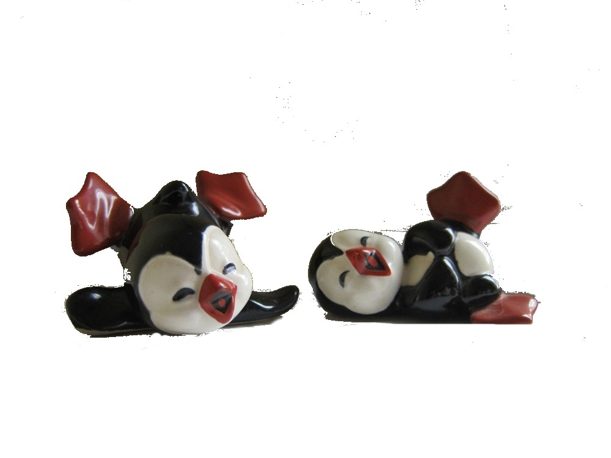

```{r setup, include=FALSE}
knitr::opts_chunk$set(echo = FALSE)
```

## La vida de un usuario de R

- **"Nuevo proyecto: voy instalando paquetes según voy necesitando."**


## La vida de un usuario de R

- "Nuevo proyecto: voy instalando paquetes según voy necesitando."
- **"No recuerdo cómo instalé aquella librería que necesito para este paquete."**

## La vida de un usuario de R

- "Nuevo proyecto: voy instalando paquetes según voy necesitando."
- "No recuerdo cómo instalé aquella librería que necesito para este paquete."
- **"En windows el proceso es muy complicado (o no funciona)."**

## La vida de un usuario de R

- "Nuevo proyecto: voy instalando paquetes según voy necesitando."
- "No recuerdo cómo instalé aquella librería que necesito para este paquete."
- "En windows el proceso es muy complicado (o no funciona)."
- **"¿Pasarlo a producción?. Claro. Muy fácil......."**

## La vida de un usuario de R

- "Nuevo proyecto: voy instalando paquetes según voy necesitando."
- "No recuerdo cómo instalé aquella librería que necesito para este paquete."
- "En windows el proceso es muy complicado (o no funciona)."
- "¿Pasarlo a producción?. Claro. Muy fácil......."
- **"Feliz con PC nuevo hasta que caes que tienes que reinstalar y configurar todo."**

## La vida de un usuario de R

- "Nuevo proyecto: voy instalando paquetes según voy necesitando."
- "No recuerdo cómo instalé aquella librería que necesito para este paquete."
- "Es que en windows es muy complicado (o no funciona)."
- "¿Pasarlo a producción?. Claro. Muy fácil......."
- "Feliz con PC nuevo: una semana hasta que todo queda igual que antes (o no)."
- **"¿compartimos el mismo entorno básico entre todo el departamento?"**
- **....y mi favorita......**

# "En mi equipo funciona".

## Soluciones habituales

- **Máquinas virtuales**

De gran tamaño, es muy complicado mover de un sitio a otro y además tienen 
requerimientos de computación exagerados. Es necesaria mucha memoria y CPU.

## Soluciones habituales

- Máquinas virtuales

- **Imágenes del disco**

Mismo problema que las máquinas virtuales pero magnificado. Las plantillas se
quedan obsoletas y hay que actualizarlas cada cierto tiempo.

## Soluciones habituales

- Máquinas virtuales

- Imágenes del disco

- **Documentarlo *TODO*.** 



## Soluciones de R

Algunos paquetes o el mismo Rstudio intentan paliar el problema:

- Packrat. Se activa en Rstudio por cada proyecto.
- checkpoint. Paquete que fija el resto de paquetes a una versión.

Seguimos sin solucionar el problema. Tenemos que hacer instalación manual.

## Docker

### ¿qué es Docker?

<center></center>

### Wikipedia:
*"Docker es un proyecto de código abierto que automatiza el despliegue de aplicaciones dentro de contenedores de software, proporcionando una capa adicional de abstracción y automatización de Virtualización a nivel de sistema operativo en Linux.*

## Docker

### ¿qué es Docker?

<center></center>

### Román paladino:
*"Lo bueno de la máquina virtual sin lo malo de la máquina virtual, aprovechando
toda la potencia de linux con el lenguaje GO.*

## Docker

### ¿Linux? ¿no lo puedo usar en Windows (o Mac OS)?

Si. Se puede usar en Windows con ciertas restricciones.

- Microsoft Hyper-V 64bit Windows 10 Pro, Enterprise / Education 

También en Mac OS, Yosemite 10.10.3 o superior

Procesadores 64 Bits, 4 GB RAM minimo.

Aunque es siempre recomendable usar Linux.(no solo para Docker, sino en general)

<center></center>

## Docker

## Ventajas

- **Aislamiento**

No dependen del hardware ni del sistema operativo host.

## Ventajas

- Aislamiento
- **Portabilidad**

Permiten mover de manera muy rápida y fácilmente el software de una máquina a
otra.

## Ventajas

- Aislamiento
- Portabilidad
- **Sencillez**

Su uso es relativamente sencillo. Basta conocer 5 ó 6 comandos y unas nociones
muy básicas. Luego si queremos podemos profundizar.

## Ventajas

- Aislamiento
- Portabilidad
- Sencillez
- **Muy popular**

Aunque esto a veces alguien lo ve como una desventaja, en este caso nos
permite acceder a muchísima documentación o ayuda de manera sencilla.
Además hay imágenes para casi todo lo que nos imaginemos.

## Conceptos básicos

- **Contenedor**

Es la parte activa con la que interactuamos. "Hace cosas".

## Conceptos básicos

- Contenedor
- **Imagen**

La plantilla en la que se basa el contenedor para saber lo que tiene que hacer.

## Conceptos básicos:

- Contenedor
- Imagen
- **Registro**

Repositorio en el cual de manera abierta se ponen a disposición las imágenes.
Uno de los más conocidos y usados es "Docker Hub". 

[https://hub.docker.com/] (https://hub.docker.com/)
            

## Conceptos básicos:

- Contenedor
- Imagen
- Registro
- **Dockerfile**

Es la *"receta"* para construir una imagen desde cero. Si conocéis Puppet o Chef 
se trata de un concepto similar. Un archivo de texto con instrucciones paso a
paso para construir una imagen.

## ¿para R?

Para todo.
Existen imagenes para levantar un contenedor linux que solo ocupa 5 MB
llamado alpine, Ubuntu , CentOS, Redis, MongoDB, Cassandra, Mysql.....
Muchas de ellas *"oficiales"*.

https://hub.docker.com/explore/


## Empieza el Rock!

Carl Boettiger (knitcitations, EML, RNeXML) y Dirk Eddelbuettel (Rcpp, RcppArmadillo, RcppEigen, digest...)
mantienen **Rocker**, un repositorio muy completo con diferentes versiones de R.

http://www.carlboettiger.info/

http://dirk.eddelbuettel.com/


## Rocker

En github:

https://github.com/rocker-org/rocker

En Docker Hub:

https://hub.docker.com/u/rocker/

## ¡Empieza el baile! (comandos básicos)

Obtener una imagen

```
docker pull rocker/rstudio

```
Generar un contenedor a partir de la imagen

```
docker run --rm -it p 8787:8787 rocker/rstudio

```
Conectar con Rocker

Abrimos el navegador y en localhost:8787 tenemos el Rstudio


## Ejemplo de Dockerfile

```
FROM rocker/rstudio:latest

RUN apt-get update -qq && apt-get -y --no-install-recommends install \
  libxml2-dev \
  libcairo2-dev \
  libsqlite-dev \
  libmariadbd-dev \
  libmariadb-client-lgpl-dev \
  libpq-dev \
  libudunits2-dev \
  libgdal1-dev \
  libproj-dev \
  && . /etc/environment \
  && install2.r --error \
	devtools \
	tidyverse ggplot2 profvis formatR remotes rio validate MASS magrittr 
	
RUN Rscript -e 'devtools::install_github("smach/rmiscutils")' 
 
RUN rm -rf /tmp/downloaded_packages/

```

## Recomendaciones para el Dockerfile

- pocas capas
- contenedores con solamente una función


## Consejos generales

- Atentos al disco duro cuando estéis aprendiendo
- Cuidado con producción
- Compartir imagenes *"es bien"*
- No reinventar la rueda

## CONCLUSIÓN

Ningún pinguino fué dañado en el curso de este trabajo

Source: https://www.docker.com/


```

docker images
REPOSITORY           TAG                 IMAGE ID            CREATED             SIZE
jvera/tidyviz-base   latest              d1103ed35e5b        9 days ago          3.94 GB
rocker/shiny         latest              682eb5fda1f3        12 days ago         1.23 GB
trescuatrodos        latest              fbac184a48f6        2 weeks ago         4.52 GB
trescuatro           latest              7781ee1f031f        2 weeks ago         4.5 GB
jvera/tidyviz        latest              3930c226a472        2 weeks ago         4.54 GB
rocker/ropensci      latest              8bf0948db340        2 weeks ago         3.46 GB
rocker/tidyverse     latest              83f91871d62f        3 weeks ago         1.56 GB
ubuntu               latest              f7b3f317ec73        4 weeks ago         117 MB
rocker/rstudio       latest              a3f43bf49425        2 months ago        990 MB
hello-world          latest              48b5124b2768        4 months ago        1.84 kB
d4w/nsenter          latest              9e4f13a0901e        8 months ago        83.8 kB

docker run -d --rm -p 8787:8787 -v C://Users/jvera/Documents/Docker:/srv/shiny-server tidyviz-base
Unable to find image 'tidyviz-base:latest' locally

docker run -d --rm -p 8787:8787 -v C://Users/jvera/Documents/Docker:/srv/shiny-server jvera/tidyviz-base
fa049d375a715923cd393b613d958b50c30651e5f172b656f556b67d2e5ca904

docker ps
CONTAINER ID        IMAGE                COMMAND             CREATED             STATUS              PORTS                              NAMES
fa049d375a71        jvera/tidyviz-base   "/init"             7 seconds ago       Up 5 seconds        3838/tcp, 0.0.0.0:8787->8787/tcp   pensive_meninsky

docker stop pensive_meninsky
pensive_meninsky

docker ps -a
CONTAINER ID        IMAGE               COMMAND             CREATED             STATUS              PORTS               NAMES

docker run -d --rm -p 8787:8787 -name viva_el_rock -v C://Users/jvera/Documents/Docker:/srv/shiny-server jvera/tidyviz-base
unknown shorthand flag: 'n' in -name
See 'docker run --help'.

docker run -d --rm -p 8787:8787 --name viva_el_rock -v C://Users/jvera/Documents/Docker:/srv/shiny-server jvera/tidyviz-base
212e27d0e90e0401285002d353e0a66b63f1149a97de731593f7ac155132bd50

docker ps
CONTAINER ID        IMAGE                COMMAND             CREATED             STATUS              PORTS                              NAMES
212e27d0e90e        jvera/tidyviz-base   "/init"             5 seconds ago       Up 4 seconds        3838/tcp, 0.0.0.0:8787->8787/tcp   viva_el_rock

```