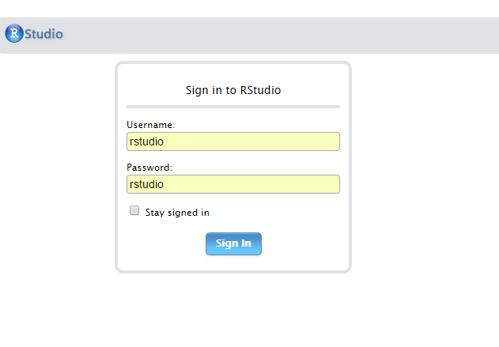

```{r setup, include=FALSE}
knitr::opts_chunk$set(echo = FALSE)
```

## La vida de un usuario de R

- **"Nuevo proyecto: voy instalando paquetes según voy necesitando."**


## La vida de un usuario de R

- "Nuevo proyecto: voy instalando paquetes según voy necesitando."
- **"No recuerdo cómo instalé aquella librería que necesito para este paquete."**

## La vida de un usuario de R

- "Nuevo proyecto: voy instalando paquetes según voy necesitando."
- "No recuerdo cómo instalé aquella librería que necesito para este paquete."
- **"En windows el proceso es muy complicado (o no funciona)."**

## La vida de un usuario de R

- "Nuevo proyecto: voy instalando paquetes según voy necesitando."
- "No recuerdo cómo instalé aquella librería que necesito para este paquete."
- "En windows el proceso es muy complicado (o no funciona)."
- **"¿Pasarlo a producción?. Claro. Muy fácil......."**

## La vida de un usuario de R

- "Nuevo proyecto: voy instalando paquetes según voy necesitando."
- "No recuerdo cómo instalé aquella librería que necesito para este paquete."
- "En windows el proceso es muy complicado (o no funciona)."
- "¿Pasarlo a producción?. Claro. Muy fácil......."
- **"Feliz con PC nuevo hasta que caes que tienes que reinstalar y configurar todo."**

## La vida de un usuario de R

- "Nuevo proyecto: voy instalando paquetes según voy necesitando."
- "No recuerdo cómo instalé aquella librería que necesito para este paquete."
- "Es que en windows es muy complicado (o no funciona)."
- "¿Pasarlo a producción?. Claro. Muy fácil......."
- "Feliz con PC nuevo: una semana hasta que todo queda igual que antes (o no)."
- **"¿compartimos el mismo entorno básico entre todo el departamento?"**

- **....y mi favorita......**

# "En mi equipo funciona".

## Soluciones habituales

- **Máquinas virtuales**

De gran tamaño, es muy complicado mover de un sitio a otro y además tienen 
requerimientos de computación exagerados. Es necesaria mucha memoria y CPU.

## Soluciones habituales

- Máquinas virtuales

- **Imágenes del disco**

Mismo problema que las máquinas virtuales pero magnificado. Las plantillas se
quedan obsoletas y hay que actualizarlas cada cierto tiempo.

## Soluciones habituales

- Máquinas virtuales

- Imágenes del disco

- **Lo documentamos *TODO*.** 


## Soluciones de R

Algunos paquetes o el mismo Rstudio intentan paliar el problema:

- Packrat. Se activa en Rstudio por cada proyecto.

- checkpoint. Paquete que fija el resto de paquetes a una versión.

Seguimos sin solucionar el problema. Tenemos que hacer instalación manual.

## ¿Qué es Docker?

<center></center>

### Wikipedia:

*"Docker es un proyecto de código abierto que automatiza el despliegue de aplicaciones dentro de contenedores de software, proporcionando una capa adicional de abstracción y automatización de Virtualización a nivel de sistema operativo en Linux.*

## ¿Qué es Docker?

<center></center>

### Mi Definición:
*"Lo bueno de la máquina virtual sin lo malo de la máquina virtual, aprovechando
toda la potencia de linux. Sólo se virtualiza lo que se necesita. Del resto se
encarga el sistema anfitrión".*

## Docker vs. Máquina Virtual

<center></center>

##  ¿Linux? 

### ¿Se puede usar en Windows (o Mac OS)?

Si. Se puede usar en Windows cumpliendo ciertos requisitos.

- Microsoft Hyper-V 64bit Windows 10 Pro, Enterprise / Education 

En Mac OS, Yosemite 10.10.3 o superior.
- procesadores 64 Bits,
- 4 GB RAM minimo.

Siempre recomendable usar Linux (no solo para Docker, sino en general)

<center></center>


## Ventajas

- **Aislamiento**

No dependen del hardware ni del sistema operativo host.

## Ventajas

- Aislamiento
- **Portabilidad**

Permiten mover de manera muy rápida y fácilmente el software de una máquina a
otra.

## Ventajas

- Aislamiento
- Portabilidad
- **Sencillez**

Su uso es relativamente sencillo. Basta conocer 5 ó 6 comandos y unas nociones
muy básicas. Luego si queremos podemos profundizar.

## Ventajas

- Aislamiento
- Portabilidad
- Sencillez
- **Muy popular**

Cada vez más usado, nos permite acceder a muchísima documentación o ayuda de 
manera sencilla.
Además hay imágenes para casi todo lo que nos imaginemos.

## Conceptos básicos

- **Contenedor**

Es la parte activa con la que interactuamos. "Hace cosas".

## Conceptos básicos

- Contenedor
- **Imagen**

La plantilla en la que se basa el contenedor para saber lo que tiene que hacer.

## Conceptos básicos

- Contenedor
- Imagen
- **Registro**

Repositorio en el cual de manera abierta se ponen a disposición las imágenes.
Uno de los más conocidos y usados es "Docker Hub". 

https://hub.docker.com/
            

## Conceptos básicos

- Contenedor
- Imagen
- Registro
- **Dockerfile**

Es la *"receta"* para construir una imagen desde cero. Si conocéis Puppet o Chef 
se trata de un concepto similar. Un archivo de texto con instrucciones paso a
paso para construir una imagen.

## Arquitectura

<center></center>

## ¿Funciona para R?

Entre otras muchas cosas.

Existen imagenes para levantar un contenedor linux que solo ocupa 5 MB (alpine),
"todas"" las distribuciones Linux (Ubuntu , CentOS, Debian), 
No Sql (Redis, MongoDB, Cassandra), Si Sql (Mysql, postgreSQL).....

Muchas de las imagenes son *"oficiales"* de los propios desarrolladores

https://hub.docker.com/explore/


## ¡Let's Rocker! 


Carl Boettiger (knitcitations, EML, RNeXML....) 


Dirk Eddelbuettel (Rcpp, RcppArmadillo, RcppEigen, digest...)

mantienen **Rocker**, un repositorio muy completo con diferentes versiones de R.


http://www.carlboettiger.info/

http://dirk.eddelbuettel.com/


## Rocker sites

En github:

https://github.com/rocker-org/rocker

En Docker Hub:

https://hub.docker.com/u/rocker/

## ¡Empieza el baile! (comandos básicos)

Obtener una imagen

```
docker pull rocker/rstudio

```
Generar un contenedor a partir de la imagen

```
docker run --rm -it p 8787:8787 rocker/rstudio

```
Conectar con Rocker
```
localhost:8787 
```
<center></center>


## ¿Dónde están los datos?

### Otro concepto básico: **Volúmenes**
Los volúmenes son puntos de montaje que asociamos a un contenedor. Mapeados
contra un directorio de nuestro sistema anfitrión nos permite tener acceso
a su contenido.

- En windows
```
docker run --rm -it p 8787:8787 -v \
C://Users/miusuario/Documents/Docker:/srv/shiny-server 6dc473697f85
```
- En Linux (más fácil, por supuesto)
```
docker run --rm -it p 8787:8787 -v /home/data:/data 6dc473697f85
```

## Más comandos útiles

- docker images
```
REPOSITORY           TAG         IMAGE ID            CREATED             SIZE
rocker/shiny         latest      682eb5fda1f3        12 days ago         1.23 GB
trescuatrodos        latest      fbac184a48f6        2 weeks ago         4.52 GB
trescuatro           latest      7781ee1f031f        2 weeks ago         4.5 GB
jvera/tidyviz        latest      3930c226a472        2 weeks ago         4.54 GB
rocker/ropensci      latest      8bf0948db340        2 weeks ago         3.46 GB
rocker/tidyverse     latest      83f91871d62f        3 weeks ago         1.56 GB
ubuntu               latest      f7b3f317ec73        4 weeks ago         117 MB
rocker/rstudio       latest      a3f43bf49425        2 months ago        990 MB
hello-world          latest      48b5124b2768        4 months ago        1.84 kB
d4w/nsenter          latest      9e4f13a0901e        8 months ago        83.8 kB
```

## Más comandos útiles

- docker ps

```
CONTAINER ID IMAGE  COMMAND CREATED  STATUS  PORTS    NAMES
fa049d375a71 ubuntu "/init" 7 s. ago Up 5 s. 3838/tcp, 0.0.0.0:8787->8787/tcp  \
pensive_meninsky
```

- docker ps -a  

(nos muestra también los contenedores parados)

- docker -name
```
docker run -d -p 8787:8787 -name rockandroll -v /home/data:/data 6dc473697f8
```

## Más comandos útiles

- docker images         (lista las imagenes)
- docker build          (construye un contenedor con un Dockerfile)
- docker rmi nombre/id  (borra la imagen)
- docker stop           (para el contenedor)
- docker rm nombre/id   (borra el contenedor)
- docker system prune   (limpia el sistema)
- docker commit         (guarda los cambios del contenedor)
- dorcker start         (iniciar nuestro contenedor)

**¡Cuidado!**

Si no se guardan los cambios el contenedor vuelve al estado inicial. Pero...

## es mejor usar el Dockerfile

Es el mejor método para guardar los cambios de nuestro contenedor y compartirlo.

```
FROM rocker/rstudio:latest

RUN apt-get update -qq && apt-get -y --no-install-recommends install \
  libxml2-dev \
  libcairo2-dev \
  libpq-dev \
  libudunits2-dev \
  && . /etc/environment \
  && install2.r --error \
	devtools tidyverse ggplot2 profvis formatR \
	remotes rio validate MASS magrittr 
	
RUN Rscript -e 'devtools::install_github("smach/rmiscutils")' 
RUN rm -rf /tmp/downloaded_packages/

```

## Con la canción empezada

¿qué ocurre si queremos compartir nuestro entorno sin tener que componer un Dockerfile desde cero?

## Con la canción empezada

http://o2r.info/2017/05/30/containerit-package/

Podemos generar un Dockerfile con nuestras sesiones de trabajo.

## Con la canción empezada

```
devtools::install_github("r-hub/sysreqs")

devtools::install_github("o2r-project/containerit")

library(containerit)

dockerfile_object <- dockerfile()

print(dockerfile_object)
```

## Con la canción empezada

```
FROM rocker/r-ver:3.4.0
LABEL maintainer="jvera"
RUN export DEBIAN_FRONTEND=noninteractive; apt-get -y update \
 && apt-get install -y libcurl4-openssl-dev \
 	libpq-dev \
 	libssl-dev \
 	make \
 	pandoc \
 	pandoc-citeproc \
 	zlib1g-dev
 RUN ["install2.r", "-r 'https://cloud.r-project.org'", "anytime", "Hmisc", "ggplot2", "Formula", "survival", "lattice",  "RPostgreSQL", "DBI", "plyr", "tidyr", "pathological", "magrittr", "rio", "dplyr", "tibble", "pacman", "Rcpp", "assertive.properties", "assertive.types", "assertthat", "digest", "R6", "cellranger", "futile.options", "backports", "acepack", "RApiDatetime", "httr", "assertive.strings", "rlang", "lazyeval", "curl", "readxl", "data.table", "rpart", "Matrix", "checkmate", "devtools", "stringr", "foreign", "htmlwidgets", "munsell", "base64enc", "htmltools", "nnet", "gridExtra", "htmlTable", "codetools", "withr", "assertive.base", "gtable", "git2r", "scales", "stringi", "latticeExtra", "assertive.reflection", "futile.logger", "openxlsx", "lambda.r", "RColorBrewer", "assertive.numbers", "colorspace", "cluster", "assertive.files", "memoise", "knitr", "haven", "remotes"]
 RUN ["installGithub.r", "krlmlr/here@efd50cb", "krlmlr/rprojroot@6d1069c"]
 WORKDIR /payload/
 CMD ["R"]
```

## Recomendaciones para el Dockerfile

- **Limitar en la medida de lo posible las capas**.


## Recomendaciones para el Dockerfile

- Limitar en la medida de lo posible las capas.
- **Contenedores para solamente una función**.

## Recomendaciones para el Dockerfile

- Limitar en la medida de lo posible las capas.
- Contenedores con solamente una función.
- **No incluir datos. Los datos "viven" fuera de los contenedores**.

## Recomendaciones para el Dockerfile

- Limitar en la medida de lo posible las capas.
- Contenedores con solamente una función.
- No incluir datos. Los datos "viven" fuera de los contenedores.
- **Aunque hay contenedores de datos**.

## Consejos generales

- **Atentos al disco duro sobre todo al principio**.


## Consejos generales

- Atentos al disco duro sobre todo al principio.
- **De momento y depende para qué, no recomiendo contenedores en producción**.


## Consejos generales

- Atentos al disco duro sobre todo al principio.
- De momento y depende para qué, no recomiendo contenedores en producción.
- **Compartir imagenes**.


## Consejos generales

- Atentos al disco duro sobre todo al principio.
- De momento y depende para qué, no recomiendo contenedores en producción.
- Compartir imagenes.
- **No reinventar la rueda, aprovecharse de los miles de imágenes que hay**.

## Consejos generales

- Atentos al disco duro sobre todo al principio.
- De momento y depende para qué, no recomiendo contenedores en producción.
- Compartir imagenes.
- No reinventar la rueda, aprovecharse de los miles de imágenes que hay.
- **Estad atentos. El proyecto evoluciona muy rápido.**.

## Cosas (un poco) avanzadas: Rock con Orquesta

- Machine:  Despliegue rápido de motores de Docker en cloud/local.

- Swarm:    clusters de contenedores. Varios motores docker como uno solo.

- Compose:  aplicaciones multicontenedor.

- Kubernetes: Orquestación

- CoreOS: Sistema operativo dedicado para aplicaciones basadas en contenedores

## Enlaces

https://www.docker.com/

https://www.docker.com/newsletter-subscription

https://github.com/veggiemonk/awesome-docker

Docker Hub:

appsecco/data-science-toolbox

kaggle/rstats

kaggle/julia

kaggle/python


## Gracias!


DockerHub: https://hub.docker.com/u/jvera/

Twitter: @verajosemanuel


#######_Ningún pinguino fué dañado en la elaboración de este trabajo._#######
