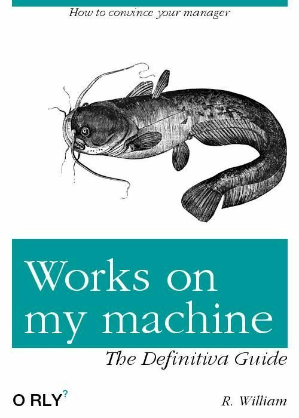
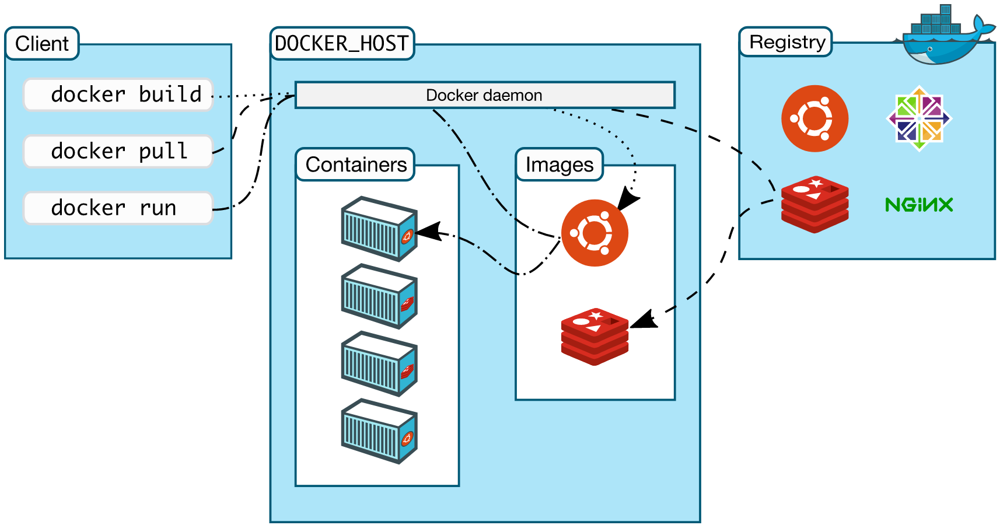

```{r setup, include=FALSE}
knitr::opts_chunk$set(echo = FALSE)
```

## About me

Data Scientist working on Financial Services for distressed asset management.

R Enthusiast.

Reached to Docker in my search of better/faster ways of sharing my work.

## Things I hate the most when working

- "Setup for a new project"
- "I couldn't remember steps to install that awesome library..."
- "Not working on windows"
- "Let's take it into production server a.s.a.p."
- "Got a new laptop! (& a long weekend installing and configuring it all)"
- "Share your analysis with anyone..."
- "Multiplatform development?"

- **....and my favourite......**

#  

<center></center>

## Common solutions

- Virtual machines:

Big size, not easy to move around. You have to install it all from scratch.

- Raw HD images:

Huge size. Same cons as virtual machines, but magnified.

- Document everything, every step, Always.....sure? 


## R is trying to help somehow

- **Packrat**

- **checkpoint**

- **minicran**

- **mran Time machine**

OS and library install/setup is not removed from our way. There's a lot of previous work.

## ¿Docker?

<center></center>

### From Wikipedia:

*Docker is a software technology providing containers, promoted by the company Docker that provides an additional layer of abstraction and automation of operating-system-level virtualization on Windows and Linux*

## ¿Docker?

<center></center>


*The best from Virtual machines without the bad part.*


## Docker vs. VM

<center></center>

##  ¿Linux only? 

### Linux, Mac OS and Windows

- Microsoft Hyper-V 64bit Windows 10 Pro, Enterprise / Education 
- Mac OS, Yosemite 10.10.3 or higher.
- 64 Bits,
- 4 GB RAM.


## Pros

- **Isolation**

Not depending on hardware or host software.

- **Portability**

Easy to move around. As simple as small a text file.

- **Easy to learn and use**

Very similar to GIT.

- **Very popular**

Easy to find tools, guidance and help surfing the web.

## Basic Concepts

- **Container**

The part that holds our working services or apps.

- **Images**

The template we use to spawn containers.

- **Registry**

People share/save their Docker containers to the world.
https://hub.docker.com/

- **Dockerfile**

The *"recipe"* to build an image. Text files like Puppet or Chef recipes. 


## Architecture

<center></center>


## ¡Let's Rocker! 


Carl Boettiger (knitcitations, EML, RNeXML....) 


Dirk Eddelbuettel (Rcpp, RcppArmadillo, RcppEigen, digest...)

http://www.carlboettiger.info/

http://dirk.eddelbuettel.com/


## Rocker sites

Git hub:

https://github.com/rocker-org/rocker

Docker Hub:

https://hub.docker.com/u/rocker/

## Basic commands

Search/get an image

```
docker search rstudio
docker pull rocker/rstudio

```
Spawn a Rstudio container using the pulled image as template

```
docker run --rm -p 8787:8787 --name="test" -v ~/dockerdata/:/data rocker/rstudio

docker run -d -p 8787:8787 rocker/rstudio:3.2.0

```

using Rstudio with Rocker

```
localhost:8787 

```

## Login

<center></center>


## where's my data?

### **Volumes**

mount points to share our files with the container.

- windows
```
docker run --rm -it p 8787:8787 -v \
C://Users/my_user/Documents/Docker:/srv/shiny-server 6dc473697f85
```
- Linux
```
docker run --rm -it p 8787:8787 -v /home/data:/data 6dc473697f85
```

## Some more commands

- docker images

```
REPOSITORY           TAG         IMAGE ID            CREATED             SIZE
rocker/shiny         latest      682eb5fda1f3        12 days ago         1.23 GB
threefourtwo         latest      fbac184a48f6        2 weeks ago         4.52 GB
threefour            latest      7781ee1f031f        2 weeks ago         4.5 GB
jvera/tidyviz        latest      3930c226a472        2 weeks ago         4.54 GB
rocker/ropensci      latest      8bf0948db340        2 weeks ago         3.46 GB
rocker/tidyverse     latest      83f91871d62f        3 weeks ago         1.56 GB
ubuntu               latest      f7b3f317ec73        4 weeks ago         117 MB
rocker/rstudio       latest      a3f43bf49425        2 months ago        990 MB
hello-world          latest      48b5124b2768        4 months ago        1.84 kB
d4w/nsenter          latest      9e4f13a0901e        8 months ago        83.8 kB
```

## Some more commands

- docker ps             (show running containers)
- docker ps -a          (show all containers)
- docker images         (list images)
- docker build          (build a container from Dockerfile)
- docker rmi name/id    (delete image)
- docker stop name/id   (stop container)
- docker rm name/id     (delete container)
- docker system prune   (clean unused containers/images)
- docker commit         (save changes from container to image)


## Better than commit...use Dockerfile

```
----------------------
FROM rocker/rstudio:latest

RUN apt-get update -qq && apt-get -y --no-install-recommends install \
  libxml2-dev \
  libcairo2-dev \
  libpq-dev \
  libudunits2-dev \
  && . /etc/environment \
  && install2.r --error \
	devtools tidyverse ggplot2 profvis formatR \
	remotes rio validate MASS magrittr 
	
RUN Rscript -e 'devtools::install_github("smach/rmiscutils")' 
RUN rm -rf /tmp/downloaded_packages/
---------------------
```
docker build .  (to build from dockerfile)

## Get a Dockerfile from our working session

http://o2r.info/2017/05/30/containerit-package/


```
devtools::install_github("r-hub/sysreqs")

devtools::install_github("o2r-project/containerit")

library(containerit)

dockerfile_object <- dockerfile()

print(dockerfile_object)
```

## Get a Dockerfile from our working session

```
FROM rocker/r-ver:3.4.0
LABEL maintainer="jvera"
RUN export DEBIAN_FRONTEND=noninteractive; apt-get -y update \
 && apt-get install -y libcurl4-openssl-dev \
 	libpq-dev \
 	libssl-dev \
 	make \
 	pandoc \
 	pandoc-citeproc \
 	zlib1g-dev
 RUN ["install2.r", "-r 'https://cloud.r-project.org'", "anytime", "Hmisc", "ggplot2", "Formula", "survival", "lattice",  "RPostgreSQL", "DBI", "plyr", "tidyr", "pathological", "magrittr", "rio", "dplyr", "tibble", "pacman", "Rcpp", "assertive.properties", "assertive.types", "assertthat", "digest", "R6", "cellranger", "futile.options", "backports", "acepack", "RApiDatetime", "httr", "assertive.strings", "rlang", "lazyeval", "curl", "readxl", "data.table", "rpart", "Matrix", "checkmate", "devtools", "stringr", "foreign", "htmlwidgets", "munsell", "base64enc", "htmltools", "nnet", "gridExtra", "htmlTable", "codetools", "withr", "assertive.base", "gtable", "git2r", "scales", "stringi", "latticeExtra", "assertive.reflection", "futile.logger", "openxlsx", "lambda.r", "RColorBrewer", "assertive.numbers", "colorspace", "cluster", "assertive.files", "memoise", "knitr", "haven", "remotes"]
 RUN ["installGithub.r", "krlmlr/here@efd50cb", "krlmlr/rprojroot@6d1069c"]
 WORKDIR /payload/
 CMD ["R"]
```

## Best practices

- **Limit number of layers**.

Every RUN command creates a layer. Don't use it too much. Size matters.

- **1 Container for just 1 service**.

- **Do not include data inside container if not really necessary, but ....**.

- **There are "Data Containers" if you need**.

- **Share your images. Be generous There's thousands of images for you to use thanks to others.**

- **Stay Tuned. Docker project evolves at a fast pace.**


## An example:

**liftr**: published recently (2017-09-29). Share your Rmarkdown analysis just including package names on YAML header. 

https://liftr.me/


## More advanced topics to navigate if you want

- *Docker Machine*

Quick cloud/local docker engine deployment.

- *Docker Swarm* 

Container clusters. Several docker engines working as one.

- *Docker Compose*  multicontainer apps.

- *Kubernetes*     Orchestration.

- *CoreOS*

OS designed just for running containters and containerized apps.

## Links

https://github.com/veggiemonk/awesome-docker

https://github.com/wch/harbor

http://o2r.info/2016/12/15/investigating-docker-and-R/

https://cran.r-project.org/web/packages/liftr/vignettes/liftr-intro.html

http://seankross.com/2017/09/17/Enough-Docker-to-be-Dangerous.html

https://github.com/PRL-PRG/docker-r-full-base

https://travis-ci.org/

https://thehftguy.com/2016/11/01/docker-in-production-an-history-of-failure/


## Some interesting images

appsecco/data-science-toolbox

kaggle/rstats

kaggle/julia

kaggle/python

/r/rocker/ropensci/

Jupyter:  https://www.dataquest.io/blog/docker-data-science/


## Thanks for attending!

Twitter: @verajosemanuel

DockerHub: https://hub.docker.com/u/jvera/

Blogdown: http://jvera.rbind.io
